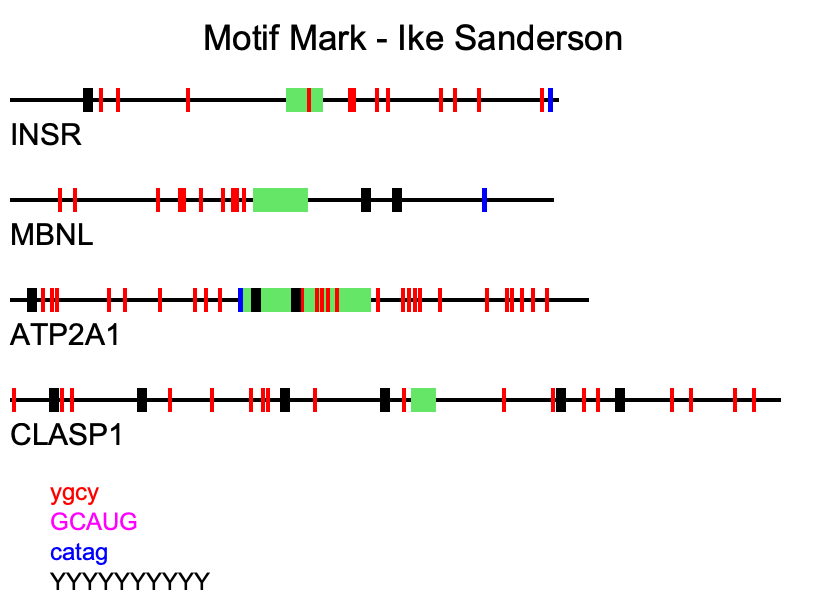

# Motif Mark  

This repository contains code and files related to a an assignment for University of Oregon's Bioinformatics and Genomics Master's Program. The assignment was to write a code that would read in a fasta file and a text file containing motif sequences and output a .png file depicting the genes, exons, and motifs in the sequences within the fasta file.  

# Introduction  

A motif in molecular biology is a sequence of bases or amino acids that holds a significant function. In this case, we were presented with DNA sequences. Motifs are often associated with functions such as regulatory sequences, enzymatic active sites, or ligand or protein binding sites.

# Coding Objectives  

- Code is capable of handling multiple sequences
- Code is capable of handling ambiguous nucleotides (i.e. motifs in which either pyrimidine in DNA (C or T) can be present in the locus (e.g., 'YGCY'-> '[CTU]GC[CTU]'))
- Code is capable of handling multiple motifs.

# Input  

- Any .fasta file will work with sequences less than 1000 bases (argparse argument -f)
- Motif .txt file with motifs up to 10 bases, one motif per line (argparse argument (-m)

# Output  

- A single well-labeled .png file with the same prefix as the input file (e.g., Figure_1.fa -> Figure_1.png)
- Motifs, exons, introns are all depicted to scale
- Genes and motifs are labeled
- Example:

# Dependencies  

- Pycairo
